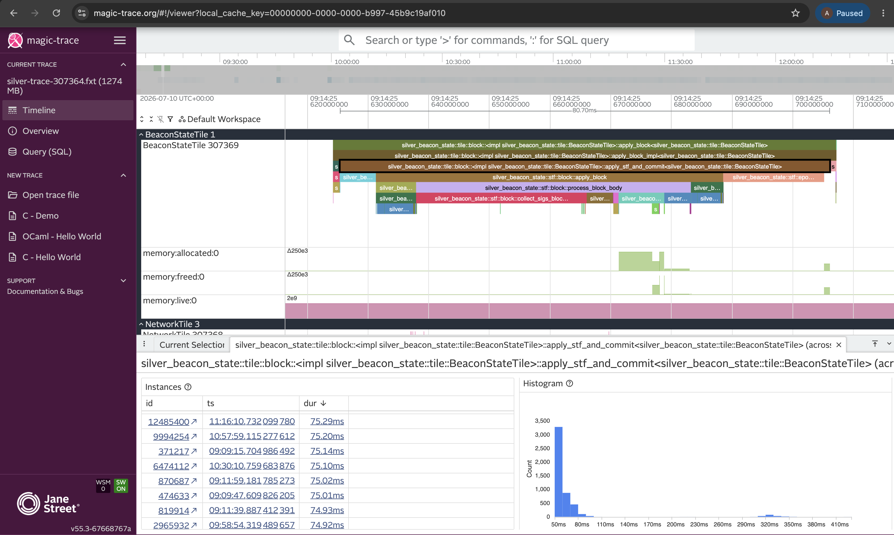

# flux-profiler

A cross-process tracing profiler for flux. Annotate functions with `#[timed]`,
run your app, then attach the `flux-profiler` CLI to capture a trace you can open
in [magic-trace](https://magic-trace.org) or [Perfetto](https://ui.perfetto.dev).

Marks are written to per-thread shared-memory rings, so the profiler reads them
from a **separate process** with zero involvement from your app after startup.

## Install

Build and install the `flux-profiler` CLI binary:

```bash
cargo install --git https://github.com/gattaca-com/flux flux-profiler
```

## Quick start

### 1. Instrument your app

```rust
use flux_profiler::{enable_profiler, timed};

#[timed]
fn handle_request() {
    parse_input();
    run_computation();
}

#[timed]
fn parse_input() { /* ... */ }

#[timed]
fn run_computation() { /* ... */ }

fn main() {
    enable_profiler("my-app"); // publishes the shmem rings under this app name

    for _ in 0..1_000_000 {
        handle_request();
    }
}
```

- `#[timed]` records an open/close frame on every exit path (return, `?`, panic).
  Frames are named `crate::module::fn` by default; pass a literal to override:
  `#[timed("custom_name")]`.
- `enable_profiler(app)` must be called once at startup before any `#[timed]`
  function runs.

### 2. Run your app, then attach the profiler

```bash
cargo run -p my-app
```

Then attach the profiler in a second terminal. If exactly one instrumented app
is live it attaches automatically; otherwise pass `--pid <pid>`:

```bash
flux-profiler
```

Press **Ctrl-C** (or let the app exit) to write the `.fxt` trace. The default
output is `<app>-trace-<pid>.fxt`. [Capture options](#capture-options) covers
capping the run, keeping memory flat, and dropping idle frames.

### 3. Open the trace

Drag the `.fxt` file into <https://magic-trace.org> or <https://ui.perfetto.dev>.



Each thread gets its own flamegraph track, with `memory:allocated`/`freed`/`live`
counters alongside it when built with `alloc-profile`. Selecting a frame shows
every instance of it and a duration histogram across the whole capture.

## Capture options

Every flag is optional: with none, the profiler captures until you stop it.

| Flag | What it does |
|---|---|
| `--pid <pid>` | Which producer to attach to. Needed only when several instrumented apps are live. |
| `--out <path.fxt>` | Where to write the trace. Defaults to `<app>-trace-<pid>.fxt`. |
| `--duration <30s\|5m\|1h>` | Stop and export after this much capture time. |
| `--max-mem <512MB\|2GB>` | Stop and export once the retained events exceed this. Defaults to `1GB`. |
| `--dump-interval <10s\|1m>` | Append the completed frames to the output every interval and free them. |
| `--filter-short-frames <100ns\|5us>` | Drop completed top-level frames shorter than this as they drain. |

### Stopping the capture

The capture ends on whichever comes first: **Ctrl-C**, the app exiting,
`--duration`, or `--max-mem`. Each of them exports the same trace Ctrl-C would.

`--max-mem` defaults to `1GB` so a forgotten profiler can't grow unbounded.
Raise it for a longer capture, or keep memory flat with `--dump-interval`.

### Long captures

`--dump-interval=30s` writes the completed frames out every 30 seconds and frees
them, so memory stays flat however long you run and `--max-mem` only ever sees
one interval's events. Each dump appends to the same `--out` file, and that file
is a complete trace at every point in between — a profiler killed mid-capture
still leaves everything it had already written.

### Merging traces

Appending works because a trace is a sequence of self-contained parts sharing one
timeline. Merging parts of one run is that same operation, so files you split up
yourself go back together with `cat` — timestamps are absolute, so nothing needs
rewriting:

```bash
cat part-1.fxt part-2.fxt > merged.fxt
```

Files from *different* runs don't merge: each run numbers threads from scratch,
so unrelated threads would collide on the same track. Open those separately.

### Skipping idle iterations

If your app spins on a hot loop, most of the capture ends up being idle
iterations that do nothing interesting. `--filter-short-frames=100ns` drops
every top-level frame that completes in under 100ns (including everything
nested inside it), so only the slow iterations survive. Filtering happens
while draining, so discarded frames don't count against `--max-mem` either.

## Try it end to end

A minimal producer example is included:

```bash
# terminal 1
cargo run -p flux-profiler --example timed_producer

# terminal 2
flux-profiler
```

## Overhead

Per-call cost of one `#[timed]` frame (open + close), measured with the bundled
`timed_overhead` example on a release build, producer and reader pinned to a
separate core each:

| State | Overhead | + while a reader drains |
|---|---|---|
| Disabled (`enable_profiler` never called) | ~1 ns | — |
| Enabled | ~12 ns | ~14 ns |
| Enabled + `alloc-profile` | ~15 ns | ~19 ns |
| Enabled + `perf` | ~62 ns | ~67 ns |

A timed frame is two shared-memory ring writes (open + close) plus two TSC
reads. The optional features stack on top:

- **`alloc-profile`** adds two more ring writes (~+4 ns).
- **`perf`** reads the hardware counters via `rdpmc` on every mark — several
  reads per mark, so **~+50 ns**, by far the dominant cost. Only enable it when
  you actually want per-frame instruction/cycle/miss counts.

The extra cost *while a reader drains* is cache-line contention on the rings —
~2 ns for a normal timed site, but it grows if you instrument something hot
enough that the reader can't keep up (a sub-10 ns leaf called tens of millions
of times per second). Disabled, a `#[timed]` call is a single atomic load;
strip it out entirely with `disable-profiling`.

Reproduce (numbers depend on your CPU; `perf` needs `perf_event_paranoid <= 2`):

```bash
taskset -c 2,3 cargo run -p flux-profiler --example timed_overhead --release
taskset -c 2,3 cargo run -p flux-profiler --example timed_overhead --release --features alloc-profile
taskset -c 2,3 cargo run -p flux-profiler --example timed_overhead --release --features perf
```

## Cargo features

| Feature | What it adds |
|---|---|
| `disable-profiling` | Compiles every `#[timed]` out to a plain function call — zero overhead, no guard, no atomic load. |
| `perf` | Per-call hardware counters (instructions, cycles, branch/cache misses) via rdpmc. Requires `kernel.perf_event_paranoid <= 2` at runtime (`<= 1` to include kernel-mode work). |
| `alloc-profile` | Per-thread allocated/freed byte counts recorded alongside each `#[timed]` mark. Wraps the global allocator. |
| `unpinned-threads` | Tags every mark with its socket (rdtscp) so timestamps stay aligned on machines with drifted per-socket TSCs (Linux only). See [Multi-socket machines](#multi-socket-machines). |

### Zero overhead when not profiling

`#[timed]` is near-free until you call `enable_profiler` (one atomic load per
call). To strip it out entirely, build with `disable-profiling` — every
`#[timed]` collapses to just the function body, so annotations can stay in the
source and vanish from production builds:

```bash
cargo run -p my-app --release --features flux-profiler/disable-profiling
```

`perf` works out of the box — enable it and the counters ride every `#[timed]`
mark:

```bash
cargo run -p flux-profiler --example timed_producer --features perf
```

`alloc-profile` additionally requires you to install the counting allocator as
your app's global allocator, so it can tally bytes. Gate it behind your own
feature flag (chained to `flux-profiler/alloc-profile`) so normal builds keep
the plain allocator untouched:

```rust
use std::alloc::System;
use flux_profiler::allocator::CountingAllocator;

#[cfg(not(feature = "alloc-profile"))]
#[global_allocator]
static GLOBAL: System = System;

#[cfg(feature = "alloc-profile")]
#[global_allocator]
static GLOBAL: CountingAllocator<System> = CountingAllocator(System);
```

`CountingAllocator` wraps any base allocator — swap `System` for `MiMalloc/Jemalloc` or
whatever you run in production.

### Multi-socket machines

Mark timestamps are raw TSC reads. On a single socket, or when TSCs are
synchronized across sockets (the common case), that's all you need: the
default build adds no per-mark overhead, and per-thread durations are exact on
any machine.

On multi-socket machines with *unsynchronized* TSCs, marks from different
sockets land on shifted timelines. Build with `unpinned-threads` to tag every
mark with its socket (one rdtscp per mark, in place of rdtsc); the reader then
calibrates a per-socket clock and places all marks on one wall-clock timeline,
correct even as threads migrate between sockets mid-capture.

Per-socket calibration is **Linux-only** — it pins the sampling thread to each
core via thread-affinity APIs that have no portable equivalent (e.g. macOS).
Other platforms fall back to a single-socket clock, which is correct for
single-socket machines (all Macs) but does not correct cross-socket TSC skew.

## License

Apache-2.0 AND MIT
